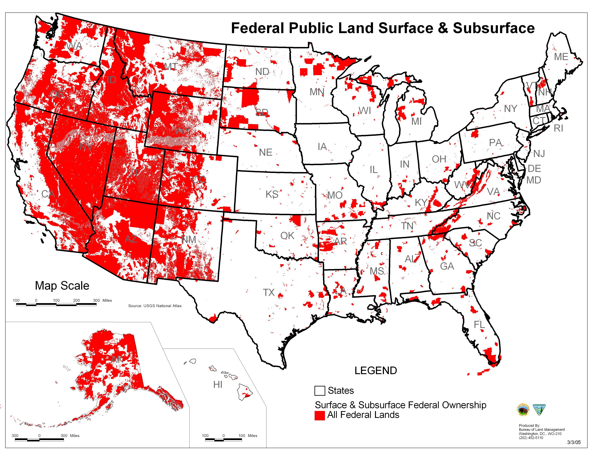

## Federal Public Land

## [Bash Infinity](https://github.com/niieani/bash-oo-framework)

Who knew you could do all this with bash?

## [Microsoft underwater data center live cameras](https://natick.research.microsoft.com/)

## [By 1303, the Chinese were solving equations of the 14th degree. What practical problem motivated such a result?](https://www.reddit.com/r/AskHistorians/comments/9bkfhj/by_1303_the_chinese_were_solving_equations_of_the/)

Interesting question and answer.

## [Checking Dependent Types with Normalization by Evaluation: A Tutorial](http://davidchristiansen.dk/tutorials/nbe/)

David Christiansen does write great tutorials, but scheme...

[A Semantics-Directed Compiler Generator](/static/semantics-directed-compiler-generator.pdf)
[Semantics of Programming Languages: A Tool-Oriented Approach](/static/semantics-of-programming-languages.pdf)

[A Realistic Compiler Generator Based on High-Level Semantics](/static/compiler-generator.pdf)
[SIS -- Semantics Implementation System](/static/sis.pdf)

## [Understanding deep learning requires rethinking generalization](https://arxiv.org/abs/1611.03530)

> Despite their massive size, successful deep artificial neural networks can exhibit a remarkably small difference between training and test performance. Conventional wisdom attributes small generalization error either to properties of the model family, or to the regularization techniques used during training.
> Through extensive systematic experiments, we show how these traditional approaches fail to explain why large neural networks generalize well in practice. Specifically, our experiments establish that state-of-the-art convolutional networks for image classification trained with stochastic gradient methods easily fit a random labeling of the training data. This phenomenon is qualitatively unaffected by explicit regularization, and occurs even if we replace the true images by completely unstructured random noise. We corroborate these experimental findings with a theoretical construction showing that simple depth two neural networks already have perfect finite sample expressivity as soon as the number of parameters exceeds the number of data points as it usually does in practice.
> We interpret our experimental findings by comparison with traditional models.

## [QSYM: a practical concolic execution engine tailored for hybrid fuzzing](https://blog.acolyer.org/2018/09/12/qsym-a-practical-concolic-execution-engine-tailored-for-hybrid-fuzzing/)

> It is worth noting that Google’s OSS-Fuzz generated 10 trillion test inputs a day [using hundreds of servers] for a few months to fuzz these applications, but QYSM ran them for three hours using a single workstation.

> the community believes that symbolic and concolic executions are slow due to path explosion and constraint solving

but in fact emulation itself is 3-5 orders of magnitude slower

## [Neural Guided Constraint Logic Programming for Program Synthesis](https://arxiv.org/abs/1809.02840)

> Synthesizing programs using example input/outputs is a classic problem in artificial intelligence. We present a method for solving Programming By Example (PBE) problems by using a neural model to guide the search of a constraint logic programming system called miniKanren. Crucially, the neural model uses miniKanren's internal representation as input; miniKanren represents a PBE problem as recursive constraints imposed by the provided examples. We explore Recurrent Neural Network and Graph Neural Network models. We contribute a modified miniKanren, drivable by an external agent, available at [this URL](https://github.com/xuexue/neuralkanren) We show that our neural-guided approach using constraints can synthesize programs faster in many cases, and importantly, can generalize to larger problems.
